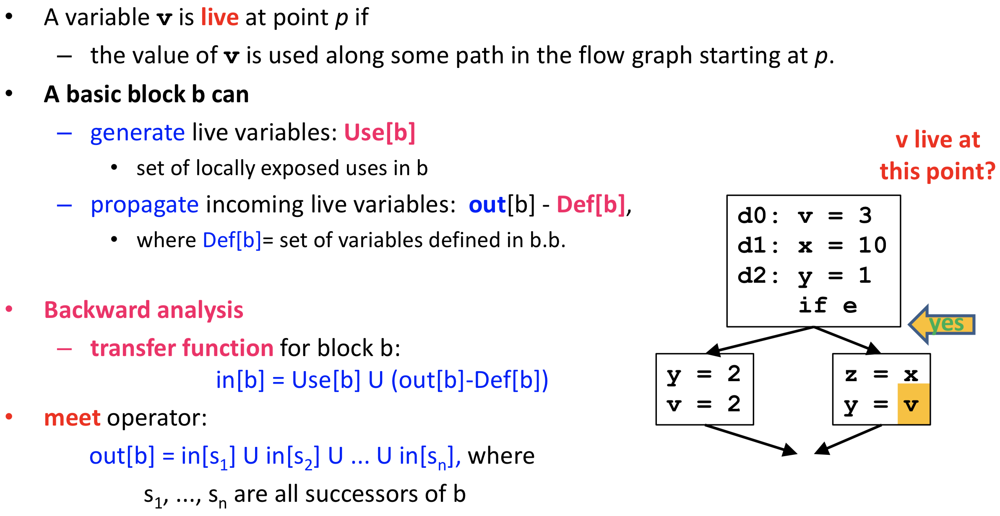

# Live Variable Analysis
Target independent live variable analysis via backward data flow equations, this implement is NOT based on the SSA algorithm.

Notice: This implement is `NOT` a backend target specific pass, i.e. current implement is a `Module` or `Function` level pass, not a `MachineFunction` level pass, for `MachineFunction` level implement please refer to LLVM source [lib/CodeGen](https://github.com/llvm-mirror/llvm/blob/master/lib/CodeGen/LiveVariables.cpp) or [cranelift's annotation](https://github.com/CraneStation/cranelift/blob/8033deda3ac152d0b95bb0ad80b419625c3f0d58/lib/cretonne/src/regalloc/liveness.rs#L1-L176)...

## Preface
More precise definition of liveness:

A variable v is `live` on a CFG edge if
- existing a direct path from that edge to use of v(node in use[v]), and
- that path does not go through any def of v(no nodes in def[v])
Here, `use[v]` is the set of CFG nodes that define variable v, while `def[v]` is the set of CFG nodes that use variable v.

==> Liveness data flow equations:

- out[B] = U{S \in succ[B]} in[S]
- in[B] = use[B] U (out[B] - def[B])

where,
in[B]: live variable set of block B at the start point;
out[B]: live variable set of block B at the end point;
def[B]: set of variables that are defined at block B;
use[B]: set of variables that are used at block B;



## Implementation
- Identify `Basic Blocks` and `Instructions` in the source code;
- Gather information about functions in the program, e.g.: no. of arguments, call sites and instructions;
- Gather information such as variable name, slot index from the source code;
- Perform `Live Variable Analysis` and dump the result.

## Build

```
$ make
$ ./liveness your_bc_file
```

Notice: Current implement is based on llvm 5.0.0


## REF
- CMU CS course, 15-411 compiler design: <https://www.cs.cmu.edu/~fp/courses/15411-f08/index.html>
- <https://www.cs.cmu.edu/afs/cs/academic/class/15745-s03/public/lectures/L4_handouts.pdf>
